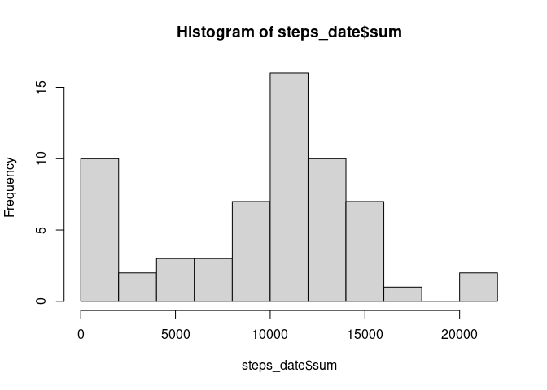
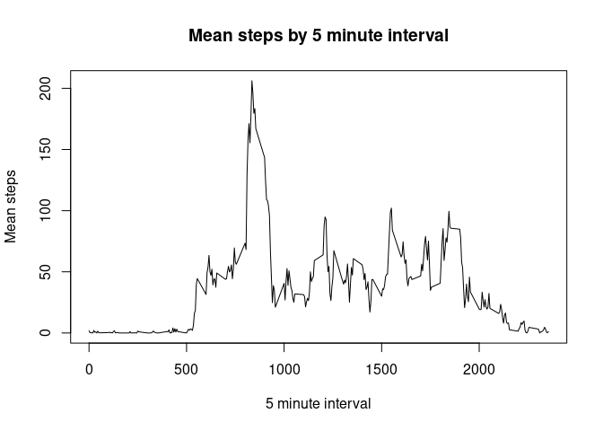
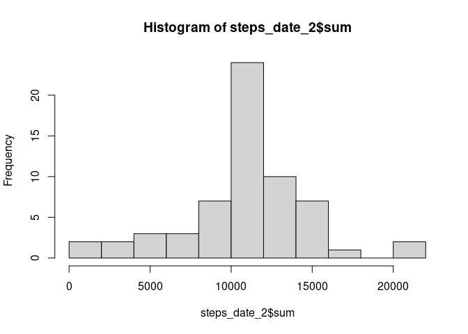
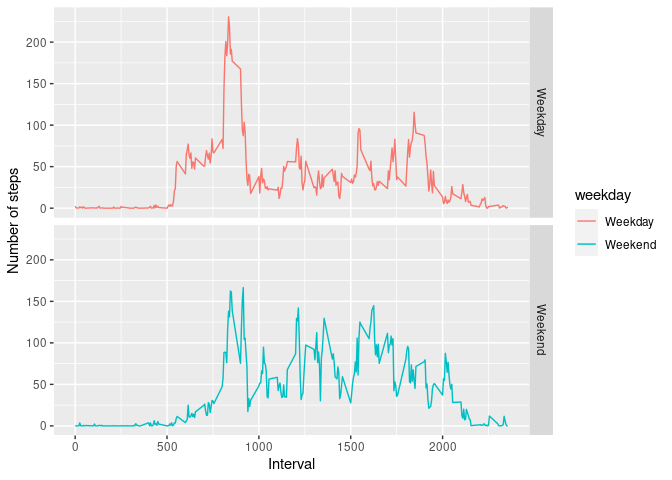

```
## 
## Attaching package: 'dplyr'
```

```
## The following objects are masked from 'package:stats':
## 
##     filter, lag
```

```
## The following objects are masked from 'package:base':
## 
##     intersect, setdiff, setequal, union
```

## Loading and preprocessing the data

Loading data set

```r
activity <- read.csv('activity.csv')
str(activity)
```

```
## 'data.frame':	17568 obs. of  3 variables:
##  $ steps   : int  NA NA NA NA NA NA NA NA NA NA ...
##  $ date    : chr  "2012-10-01" "2012-10-01" "2012-10-01" "2012-10-01" ...
##  $ interval: int  0 5 10 15 20 25 30 35 40 45 ...
```

Processing data

```r
steps_date <- activity %>%
  dplyr::select(date, steps) %>%
  dplyr::group_by(date) %>% 
  dplyr::summarise(sum = sum(steps, na.rm = TRUE))
```

```
## `summarise()` ungrouping output (override with `.groups` argument)
```

```r
head(steps_date)
```

```
## # A tibble: 6 x 2
##   date         sum
##   <chr>      <int>
## 1 2012-10-01     0
## 2 2012-10-02   126
## 3 2012-10-03 11352
## 4 2012-10-04 12116
## 5 2012-10-05 13294
## 6 2012-10-06 15420
```

## What is mean total number of steps taken per day?

```r
hist(steps_date$sum, breaks = 10)
```

<!-- -->

Mean and median of the total number of steps taken per day

```r
mean(steps_date$sum)
```

```
## [1] 9354.23
```

```r
median(steps_date$sum)
```

```
## [1] 10395
```

## What is the average daily activity pattern?
Time series plot of the 5-minute interval and the average number of steps taken, averaged across all days

```r
steps_interval <- activity %>%
  dplyr::select(interval, steps) %>%
  dplyr::group_by(interval) %>% 
  dplyr::summarise(mean = mean(steps, na.rm = TRUE))
```

```
## `summarise()` ungrouping output (override with `.groups` argument)
```

```r
plot(
  x = steps_interval$interval, 
  y = steps_interval$mean, 
  type = 'l', 
  xlab = '5 minute interval',
  ylab = 'Mean steps',
  main = 'Mean steps by 5 minute interval')
```

<!-- -->

5-minute interval, on average across all the days in the dataset, contains the maximum number of steps

```r
steps_interval %>% dplyr::filter(mean == max(mean))
```

```
## # A tibble: 1 x 2
##   interval  mean
##      <int> <dbl>
## 1      835  206.
```

## Imputing missing values
Total number of rows with \color{red}{\verb|NA|}NAs

```r
sum(is.na(activity$steps))
```

```
## [1] 2304
```

Filling missing values, we're going to fill with the mean for that interval

```r
#activity_nas <- data.frame(activity)
activity_nas <- read.csv('activity.csv')
steps_fill <- activity %>%
  dplyr::filter(is.na(steps)) %>%
  dplyr::left_join(steps_interval, by = "interval")

activity_nas[is.na(activity$steps),]$steps <- steps_fill$mean
#activity_nas <- replace(activity, activity[is.na(activity$steps),]$steps, )
head(activity_nas)
```

```
##       steps       date interval
## 1 1.7169811 2012-10-01        0
## 2 0.3396226 2012-10-01        5
## 3 0.1320755 2012-10-01       10
## 4 0.1509434 2012-10-01       15
## 5 0.0754717 2012-10-01       20
## 6 2.0943396 2012-10-01       25
```

Histogram of the total number of steps taken each day

```r
steps_date_2 <- activity_nas %>%
  dplyr::select(date, steps) %>%
  dplyr::group_by(date) %>% 
  dplyr::summarise(sum = sum(steps))
```

```
## `summarise()` ungrouping output (override with `.groups` argument)
```

```r
hist(steps_date_2$sum, breaks = 10)
```

<!-- -->

Mean and Median

```r
mean(steps_date_2$sum)
```

```
## [1] 10766.19
```

```r
median(steps_date_2$sum)
```

```
## [1] 10766.19
```
As we can verify, the mean and median are now equal, and higher than the previous calculated values. That was expected because we are replacing missing values with the mean, and we can verify with the histogram. 

## Are there differences in activity patterns between weekdays and weekends?

Add variable to dataset

```r
activity_nas <- activity_nas %>% 
    dplyr::mutate(date = as.Date(date)) %>%
    dplyr::mutate(weekday = ifelse(weekdays(date) %in% c("sábado", "domingo"), "Weekend", "Weekday")) %>%
    dplyr::mutate(day = weekdays(date)) %>%
    dplyr::mutate(weekday = as.factor(weekday))
head(activity_nas, 10)
```

```
##        steps       date interval weekday     day
## 1  1.7169811 2012-10-01        0 Weekday segunda
## 2  0.3396226 2012-10-01        5 Weekday segunda
## 3  0.1320755 2012-10-01       10 Weekday segunda
## 4  0.1509434 2012-10-01       15 Weekday segunda
## 5  0.0754717 2012-10-01       20 Weekday segunda
## 6  2.0943396 2012-10-01       25 Weekday segunda
## 7  0.5283019 2012-10-01       30 Weekday segunda
## 8  0.8679245 2012-10-01       35 Weekday segunda
## 9  0.0000000 2012-10-01       40 Weekday segunda
## 10 1.4716981 2012-10-01       45 Weekday segunda
```

Plot panel

```r
steps_interval_2 <- activity_nas %>%
    dplyr::select(steps, interval, weekday) %>%
    dplyr::group_by(interval, weekday) %>%
    dplyr::summarise(mean_steps = mean(steps))
```

```
## `summarise()` regrouping output by 'interval' (override with `.groups` argument)
```

```r
ggplot(steps_interval_2, aes(x = interval, y = mean_steps, color = weekday)) +
    facet_grid(weekday~.) +
    geom_line() +
    labs(x = 'Interval', y = 'Number of steps')
```

<!-- -->


